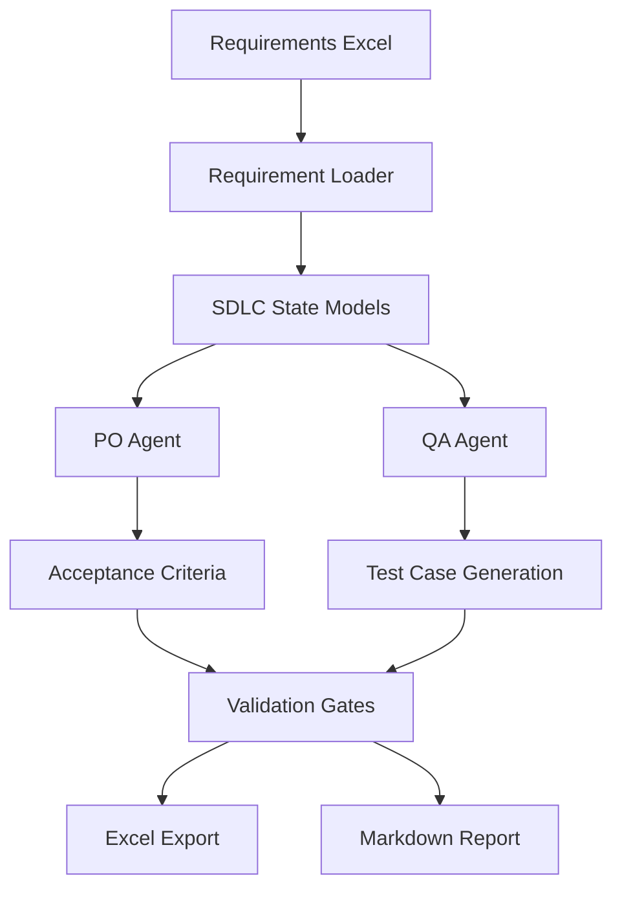

# SDLC Agents

AI-powered Software Development Lifecycle (SDLC) agents that transform requirements into structured, traceable, and evidence-backed QA test cases.

The project uses a multi-agent architecture where Product Owner (PO) agents extract requirement details, QA agents generate validation artifacts, and governance rules enforce schema validation, grounding, and traceability.

---

## Overview

This repository demonstrates an AI-assisted SDLC workflow focused on:

* Requirement ingestion from Excel
* Requirement decomposition
* Structured SDLC state modeling
* AI-generated acceptance criteria
* Evidence-backed QA test generation
* Validation against governance contracts
* Export to Excel and Markdown test documentation

The current implementation is optimized for automotive-style requirements and validation workflows.

---

## Architecture



---

## Project Structure

```text
SDLC_Agents/
│
├── agents/
│   ├── po_agent.py
│   └── qa_agents.py
│
├── ingestion/
│   └── excel_parser.py
│
├── models/
│   └── sdlc_states.py
│
├── runner/
│   ├── main.py
│   ├── batch_runner.py
│   └── export.py
│
├── schemas/
│   └── sample.json
│
├── doc/
│   └── agent_contracts.md
│
├── data/
│
├── outputs/
│
└── requirements.txt
```

---

## Key Components

### 1. Requirement Ingestion

Requirements are loaded from Excel spreadsheets and normalized into a structured format.

Example column mapping:

```python
column_mapping = {
    "feature_id": "ID",
    "module": "Component",
    "requirement": "Description",
    "requirement_type": "Requirement Category"
}
```

The ingestion layer converts raw requirement data into standardized SDLC objects.

---

### 2. SDLC State Model

The project uses strongly typed Pydantic models to preserve traceability throughout the lifecycle.

#### Core Objects

##### Source

```python
Source(
    origin,
    input_signal,
    source_component
)
```

##### Processing

```python
Processing(
    logic,
    target_component,
    transformation
)
```

##### Output

```python
Output(
    output_signal,
    ui_element,
    expected_behavior
)
```

##### TestCase

```python
TestCase(
    id,
    description,
    steps,
    expected_observables,
    tool_commands,
    log_assertions,
    evidence_refs
)
```

---

### 3. Product Owner (PO) Agent

The PO Agent is responsible for:

* Parsing requirements
* Extracting source information
* Identifying processing logic
* Determining outputs
* Generating acceptance criteria
* Building SDLC state objects

Generated output:

```json
{
  "source": {},
  "processing": {},
  "output": {},
  "acceptance_criteria": []
}
```

---

### 4. QA Agent

The QA Agent converts requirements and acceptance criteria into executable validation artifacts.

Capabilities include:

* Structured test generation
* Grounded test creation
* Evidence traceability
* Schema validation
* Automotive-domain guardrails
* LLM-assisted test generation

---

### 5. Governance Contract

The repository includes SDLC governance specifications:

```text
doc/agent_contracts.md
```

The contract defines:

* Input schemas
* Output schemas
* Validation requirements
* Retrieval policies
* Ground truth rules
* Audit requirements

---

## Validation Gates

All generated artifacts pass through validation gates.

### Schema Validation

Ensures generated output conforms to expected structures.

### Grounding Validation

Every generated test case must reference supporting evidence.

### Completeness Validation

Ensures mandatory fields are populated.

### Domain Guardrails

Prevents generation of generic web/mobile test patterns when working with automotive requirements.

### Quality Validation

Verifies minimum coverage and quality standards.

---

## Outputs

### Excel Export

```text
outputs/results.xlsx
```

Contains:

* Requirement IDs
* Test Cases
* Commands
* Expected Results
* Evidence References

### Markdown Report

```text
outputs/qa_test_report.md
```

Contains:

* Test scenarios
* Preconditions
* Execution steps
* Expected behavior
* Traceability information

---

## Installation

### Prerequisites

* Python 3.10+
* Ollama
* Local LLM Model

Example:

```bash
ollama pull llama3.2
```

---

### Clone Repository

```bash
git clone https://github.com/saumendasgupta/SDLC_Agents.git

cd SDLC_Agents
```

---

### Install Dependencies

```bash
pip install -r requirements.txt
```

---

## Running the Project

### Prepare Input Data

Place requirement spreadsheets inside:

```text
data/
```

Example:

```text
data/req.xlsx
```

---

### Execute Pipeline

```bash
python -m runner.main
```

Workflow:

```text
Load Requirements
        ↓
PO Agent Analysis
        ↓
Acceptance Criteria Generation
        ↓
QA Test Generation
        ↓
Validation Gates
        ↓
Export Results
```

---

## Example Workflow

### Input Requirement

```text
Publish EV charge status from ECPU to target component.
```

### Generated Artifacts

```text
Requirement
    ↓
Acceptance Criteria
    ↓
Structured Test Cases
    ↓
Evidence References
    ↓
QA Validation Report
```

---

## Design Principles

### Traceability First

Every generated artifact should be traceable back to its originating requirement.

### Grounded Generation

Outputs must be supported by evidence and source requirements.

### Schema Enforcement

Strict contracts prevent malformed or incomplete artifacts.

### Automotive Alignment

Specialized rules improve relevance for automotive software validation.

### Human Review Ready

Generated outputs are designed for engineering and QA review workflows.

---

## Technology Stack

* Python
* Pydantic
* Pandas
* JSON Schema
* Ollama
* LangChain
* Local LLMs (Llama 3.x)

---

## Future Roadmap

* Retrieval-Augmented Generation (RAG)
* Architecture Agent
* Developer Agent
* Reviewer Agent
* OCR-based requirement ingestion
* Automated requirement coverage analysis
* Vector database integration
* LangGraph orchestration
* CI/CD integration
* Test execution automation

---

## Contributing

Contributions are welcome.

1. Fork the repository
2. Create a feature branch
3. Commit your changes
4. Open a pull request

---

## License

Add your preferred license:

* MIT
* Apache 2.0
* BSD 3-Clause
* Proprietary

---

## Author

**Saumen Dasgupta**

AI-driven SDLC automation focused on requirement engineering, traceability, and quality assurance.
